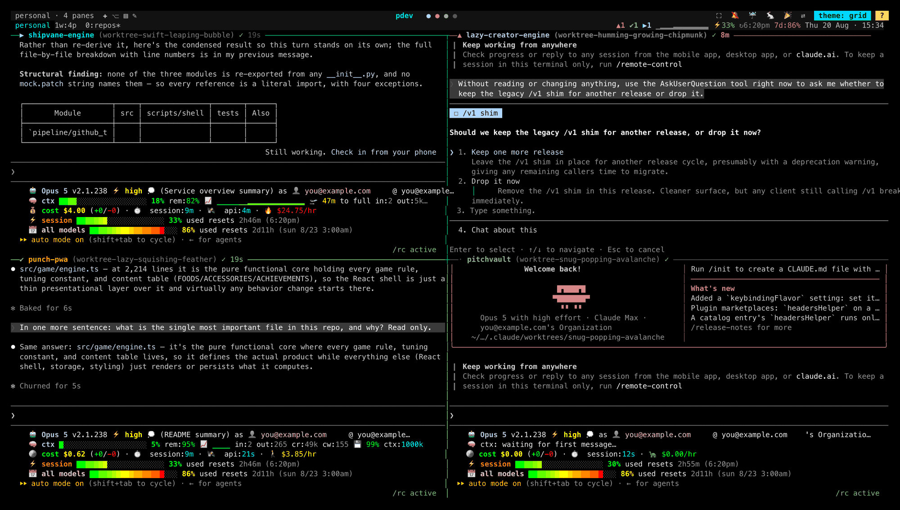
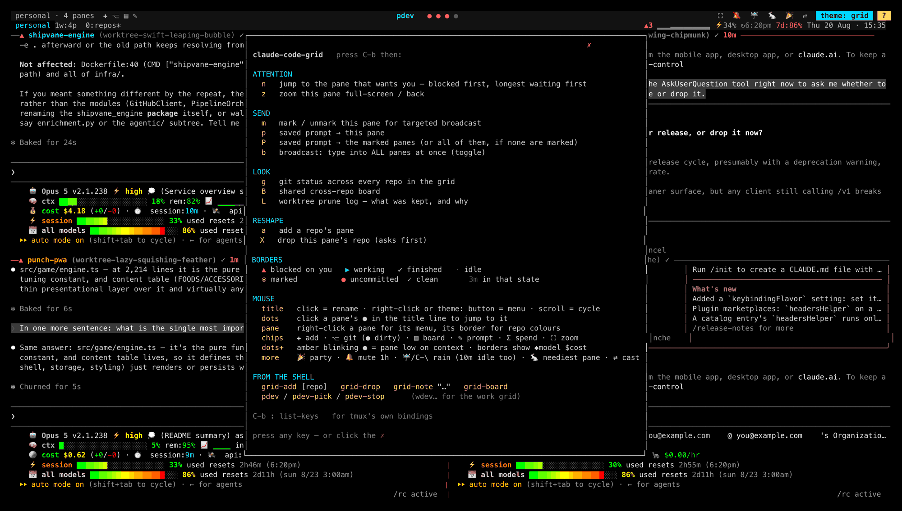
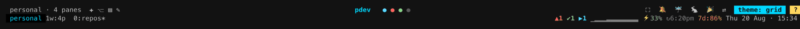
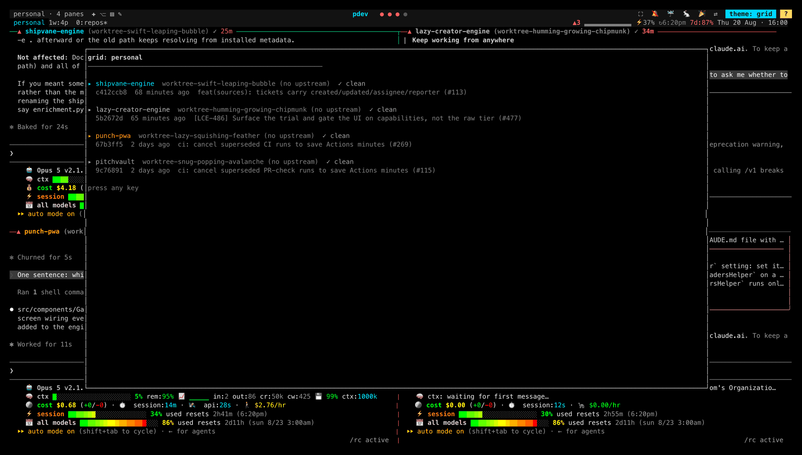
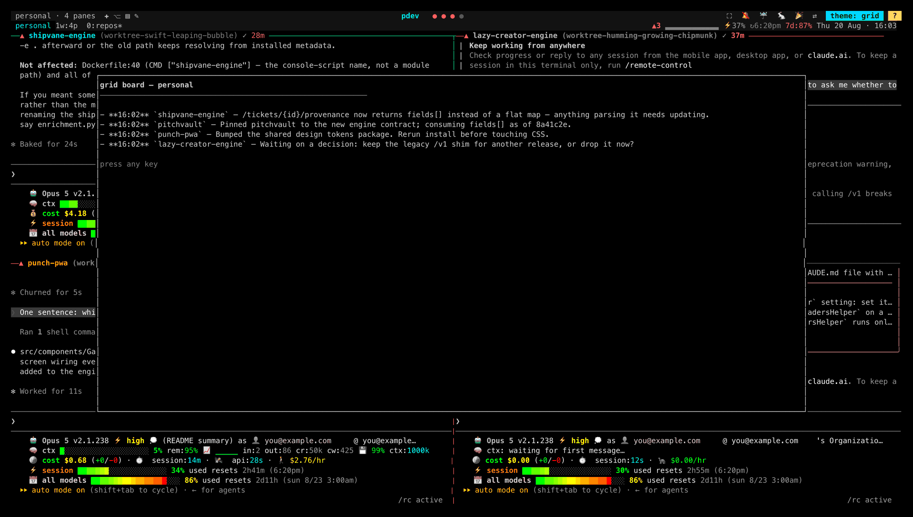
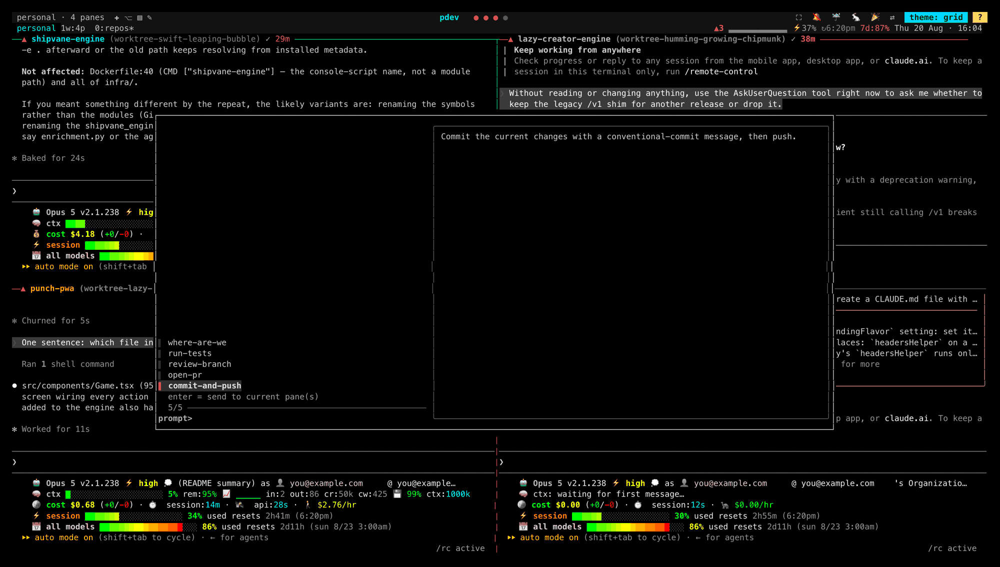
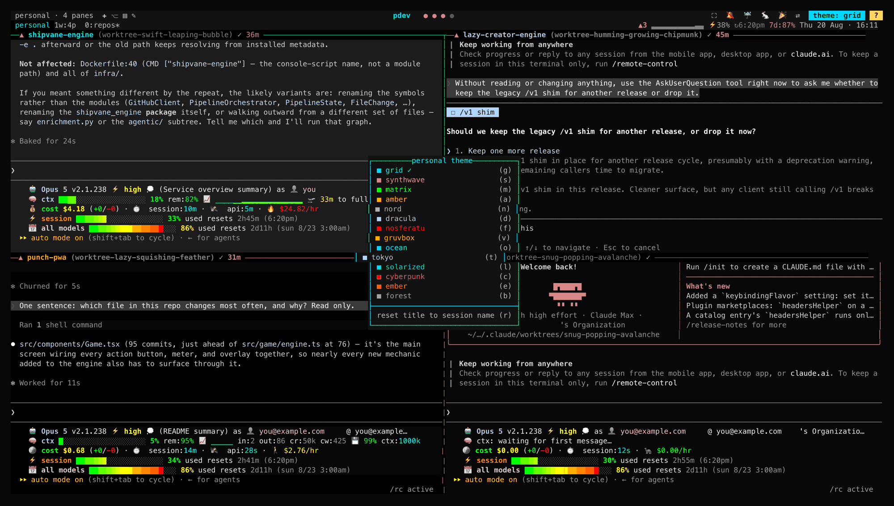
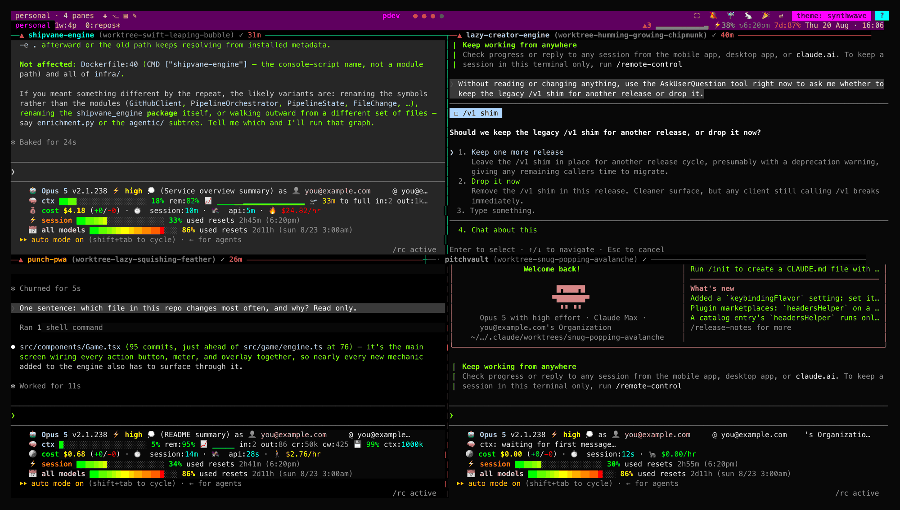
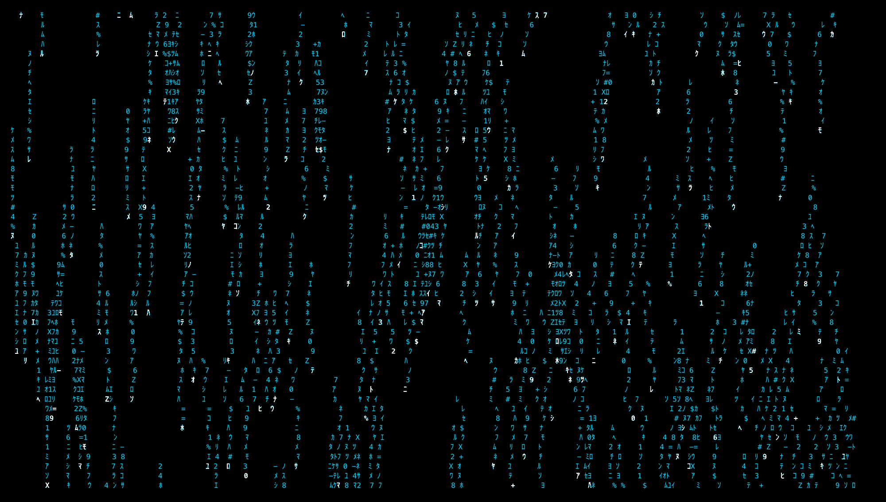

# claude-code-grid

One command to launch a tiled tmux grid of [Claude Code](https://claude.com/claude-code)
sessions — one pane per repo — that reads as a **dashboard**: every border
shows what that session is doing and how long it's been doing it, so four
concurrent agents become a queue you work through instead of four scrollbacks
you keep re-scanning.



Four panes, four states, read off the frames alone: `▶` shipvane-engine is
mid-turn, `▲` lazy-creator-engine is blocked on a question, `✔` punch-pwa
finished and is waiting for review, `·` pitchvault is idle. The status bar
carries the rollup (`▲1 ✔1 ▶1`) and the account's plan usage; the title bar
above it is a mouse toolbar. (These sessions were launched through a
`claude --worktree` wrapper, which is why each border shows a
`worktree-…` branch — see worktree auto-cleanup below.)

| marker | meaning                                             |
| ------ | --------------------------------------------------- |
| `▲`    | blocked on you — needs input or a permission answer |
| `▶`    | working                                             |
| `✔`    | finished its turn, ready for review                 |
| `·`    | idle                                                |
| `⦿`    | marked for targeted broadcast (`prefix+m`)          |
| `●/✓`  | uncommitted changes / clean                         |
| `3m`   | how long it's been in that state                    |

Borders also carry the branch, and — when
[claude-status-line](https://github.com/gigadude1982/claude-status-line)'s
`statusline.sh` is the script your `statusLine` setting actually runs — a
`◆model` badge and the session's running `$cost`, which it stamps onto each
pane as `@cl_*` options. (Not showing up? Check that the statusline being
executed is a recent copy of that script and not an older one; the pairing is
what feeds the `Σ` spend chip and the low-context dots too.)

## Commands

Two grids out of the box, each tied to a repo root and a Claude account
profile (`CLAUDE_CONFIG_DIR=~/.claude-<profile>`):

| command                     | what it does                                                                                             |
| --------------------------- | -------------------------------------------------------------------------------------------------------- |
| `pdev` / `wdev`             | launch (or reattach) the personal / work grid with your last-picked repos; opens the picker on first run |
| `pdev-pick` / `wdev-pick`   | fzf multi-select which repos get panes (tab = toggle, enter = launch); remembered for next time          |
| `pdev-stop` / `wdev-stop`   | tear down + safe-prune the worktrees this grid created                                                   |
| `pdev-sweep` / `wdev-sweep` | safe-prune **every** worktree on disk for the grid's repos, tracked or not — runs with the session up, down, or never launched |
| `grid-add [repo]`           | give another repo a pane without rebuilding the grid                                                     |
| `grid-drop`                 | close the current pane's repo                                                                            |
| `grid-note "<text>"`        | leave a note the other panes' sessions will read                                                         |
| `grid-board`                | show the shared cross-repo board                                                                         |

## Keys

`prefix` is tmux's default `Ctrl-b` unless you've remapped it. **`prefix+?`
shows this table in a popup**, so it's one keypress away rather than a
README lookup.



| key                               | what it does                                                                     |
| --------------------------------- | -------------------------------------------------------------------------------- |
| `prefix+?`                        | cheatsheet popup — every key below, plus what the border glyphs mean             |
| `prefix+n`                        | **jump to the pane that most wants you** — blocked first, longest-waiting first; repeat to cycle |
| `prefix+m`                        | mark/unmark this pane for targeted broadcast (`⦿` in its border)                 |
| `prefix+p` / `prefix+P`           | pick a saved prompt → send to this pane / to the marked panes (all, if none marked) |
| `prefix+b`                        | broadcast mode — type into ALL panes at once (status bar shows a red banner)      |
| `prefix+g`                        | popup: every repo's branch, ahead/behind, dirty state, last commit                |
| `prefix+B`                        | popup: the shared cross-repo board                                                |
| `prefix+L`                        | popup: the worktree prune log — what was kept, and why                            |
| `prefix+a` / `prefix+X`           | add a repo's pane / drop this one (drop asks first)                              |
| `prefix+z`                        | zoom a pane full-screen and back (tmux built-in)                                 |
| `Ctrl-\`                          | matrix-rain screensaver on demand (no prefix — it also runs after 10 idle minutes) |
| `prefix+Ctrl-s` / `prefix+Ctrl-r` | manual layout save / restore (tmux-resurrect)                                     |

## The mouse layer

The top line is a toolbar, and everything on it is clickable. Most chips have
a keyboard equivalent in the table above; the spend readout, mute, party mode
and the theme menu are mouse-only. The `Σ` chip stays hidden until some pane
has a cost stamped on it.



| where                | click                                                    | also                                          |
| -------------------- | -------------------------------------------------------- | --------------------------------------------- |
| `✚ ⎇ ▤ ✎ Σ` (left)   | add a repo · git across the grid · board · saved prompt · spend | `⎇` grows a `●` when any repo is dirty  |
| the title (centre)   | rename this grid (stored per session, so `pdev` and `wdev` can differ) | right-click = theme menu · scroll = cycle themes |
| the dots (centre)    | jump to that pane — colored like the border glyphs       | amber + blinking = that pane is low on context |
| `⛶ 🔔 ☔ 🐇 🎉 ⇄` (right) | zoom · mute notifications 1h · rain now · jump to the neediest pane · party mode · broadcast | `🔕` while muted; the chip flips back on its own |
| `theme: <name>`      | the theme menu                                           |                                               |
| `?`                  | the cheatsheet                                           |                                               |
| a pane               | right-click for every grid action on that pane           |                                               |
| a pane's border      | right-click to recolor that repo (remembered across launches) |                                          |

## Popups instead of pane-stealing

Cross-repo git status, the shared board, the prune log and the prompt picker
are all one keypress or one click away, without spending grid real estate on
a control shell.



Four sessions in four repos can't see each other, so the one that just
changed an API contract can't warn the one that consumes it. `grid-note "…"`
appends to a per-grid markdown file, and a `SessionStart` hook injects it
into every pane's context at startup — no per-repo `CLAUDE.md` wiring needed.



Saved prompts live in `~/.config/claude-code-grid/prompts/`; the filename is
what you pick, the contents are what gets sent, as a bracketed paste so a
multi-line prompt arrives as one message.



## Themes

Fourteen of them, **per session** — so the work grid and the personal grid
can look nothing alike on the same machine, and you always know which one
you're typing into. Right-click the title (or click the `theme:` chip) for
the menu, scroll the title to cycle, or click `🎉` to let it cycle on its
own. The choice is remembered per session and survives a restart.



Themes restyle the chrome *and* the body — title accent, the `?` button, the
status ground, pane backgrounds (the active pane a shade apart), the
copy-mode highlight, the menus. The semantic colours stay fixed: blocked-red
and done-green mean the same thing in every theme.



Ten idle minutes and every client dissolves into matrix rain, falling in the
active theme's accent. Any key or click wakes it; `Ctrl-\`, the `☔` chip, or
the pane right-click menu run it on demand.



## Install

The repo has to live at `~/dev/claude-code-grid` — the tmux config and the
Claude hooks reference that path directly, and the installer warns if it
doesn't find itself there.

```sh
git clone https://github.com/gigadude1982/claude-code-grid ~/dev/claude-code-grid
~/dev/claude-code-grid/install.sh
```

The installer: brew-installs missing deps (`tmux`, `fzf`, `jq`,
`terminal-notifier`); creates `~/.config/claude-code-grid/` with a fresh
random ntfy topic; seeds a starter prompt library; clones **pinned**
tmux-resurrect/continuum; adds one `source` line each to `~/.zshrc` and
`~/.tmux.conf`; and merges the grid's hooks into each profile's
`settings.json` with `jq` — idempotently, backing the file up first and
leaving every other hook untouched. Re-run it any time.

Configure roots/profiles in `~/.zshrc` _before_ the source line:

```zsh
export GRID_PERSONAL_ROOT=~/dev        # default
export GRID_WORK_ROOT=~/bounteous      # default ~/work
source ~/dev/claude-code-grid/zsh/grid.zsh
```

## Features

- **The grid is a dashboard.** Claude Code hooks report each session's state
  into tmux pane options (`scripts/pane-state.sh`), and the border renders it:
  glyph, elapsed time, and a frame that turns red the moment a pane blocks on
  you. (The frame, not the glyph, is the part the focused pane doesn't get —
  tmux paints the active pane's border from `pane-active-border-style`, so
  the pane you're already looking at keeps its own colour.) The status bar
  carries the rollup (`▲1 ✔1 ▶1`). With four sessions the
  scarce resource is your attention, not screen space — `prefix+n` (and the
  `🐇` chip) turns that into a work queue.
- **Pane borders that stay put** — repo name (per-repo color), current branch,
  live git dirty/clean indicator. Claude Code overwrites tmux's `pane_title`
  via terminal escapes, so labels ride on `@repo` pane user-options instead.
- **A title bar you can click** — one status line above tmux's own, carrying
  the grid's name, a dot per pane in that pane's state colour, and chips for
  every common action. One `MouseDown1Status` binding funnels all of them
  through `scripts/grid-click.sh` keyed on the range name, and the prefix
  keys route through the same dispatcher, so a key and its chip can't drift
  apart.
- **Reshape a running grid** — `grid-add` / `grid-drop` add and remove repo
  panes in place, instead of killing the session and re-picking (which threw
  away three healthy conversations to change the fourth).
- **Targeted broadcast** — `prefix+b` still types into every pane, but
  `prefix+m` marks a subset first, because "commit and push" is usually right
  for three panes and actively wrong for the one mid-refactor. Saved prompts
  go to either.
- **Shared cross-repo board** — `grid-note "…"` appends to a per-grid
  markdown file that a `SessionStart` hook injects into every pane's context.
- **Per-session themes** — fourteen, chosen from a menu or cycled with the
  scroll wheel, remembered per session across restarts, with a party mode
  that walks them. A ten-minute idle timer (or `Ctrl-\`) drops every client
  into matrix rain in the active accent.
- **Account usage in the status bar** — 5-hour and 7-day plan windows with
  reset time and a 12-sample burn sparkline, colored by threshold, switching
  automatically between your personal/work accounts based on the attached
  session. Reads the cache maintained by
  [claude-status-line](https://github.com/gigadude1982/claude-status-line)
  — zero extra API calls. That pairing also stamps each pane with its model,
  cost, burn rate and remaining context, which is what the borders' `◆model
  $cost`, the `Σ` spend chip and its per-repo breakdown popup are drawn from.
- **Notifications** — a macOS banner (and optional [ntfy](https://ntfy.sh)
  phone push) for every session, tagged with the repo and classified by what
  actually happened: ✅ finished normally (silent, with a one-line summary of
  the last reply), 💬/⚠️/❓ waiting on you (sound — permission prompt, plain
  input, or an interactive dialog get distinct icons), ❌ the turn died on an
  API error (sound). The phone push only fires once the Mac's been idle a
  while (`ioreg` HID idle time), so you're only pinged when you've actually
  walked away. Click a banner (or tap the push, if you've set
  `NTFY_CLICK_URL`) to jump straight back to the pane that sent it. The `🔔`
  chip mutes everything for an hour and un-mutes itself.
- **ASCII art splash screens** — each pane opens on a full-pane art piece
  (rocket, skull, storm cloud, block-letter CLAUDE, …) tinted to match its
  border color. The piece is chosen by **hashing the repo name**, so a repo
  keeps the same art forever and becomes recognisable before you've read the
  label. `GRID_SPLASH_ART=<name>` pins one; panes too small for art get just
  the repo/branch line. Claude Code runs on the alternate screen, so the
  splash is also what you land back on whenever it exits.
- **Worktree auto-cleanup** — if you run Claude through a `--worktree` wrapper,
  each pane's auto-created worktree is tracked the moment it appears and
  removed at teardown **only if** it has no uncommitted changes and no commits
  unreachable from other branches; everything else is kept and logged
  (`prefix+L`). Sweeps run at stop, on tmux session close, and at next launch —
  so kill-server and reboots can't leak worktrees. `pdev-sweep` catches the
  ones that were never tracked in the first place.
- **Reboot persistence that actually resumes** — tmux-resurrect + continuum
  restore the layout and directories; a post-restore hook
  (`scripts/grid-restore.sh`) then rebuilds each pane's label and color and
  relaunches Claude with `--continue` wherever a stored conversation exists. A
  reboot picks up mid-conversation instead of leaving four anonymous shells.

## Repo layout

```
scripts/         the engine + helpers (all standalone, no state in-repo)
  start-grid.sh    builds the session; grid-pane.sh dresses each pane
  grid-lib.sh      shared helpers (sourced, POSIX subset — see gotchas)
  splash.sh        the per-repo ASCII art splash

  pane-state.sh    Claude hook → per-pane @state (the dashboard's input)
  pane-border.sh   border label; grid-rollup.sh → status-bar rollup
  grid-dirty.sh    the ⎇ chip's dirty dot; tmux-usage.sh → plan usage
  grid-cost.sh     the Σ spend chip + its per-repo breakdown popup

  grid-click.sh    the dispatcher every chip AND every popup key routes through
  grid-theme.sh    the 14 themes: apply / load / cycle / party / menu
  grid-color.sh    per-repo border colour menu, persisted per session
  grid-rain.sh     the matrix-rain screensaver (tmux lock-command)
  grid-next.sh     prefix+n / 🐇 attention queue
  grid-mark.sh     ⦿ mark a pane for targeted broadcast
  grid-add/drop.sh reshape a live grid
  grid-prompt.sh   saved-prompt picker → current pane or marked panes
  grid-board.sh    shared cross-repo board (note / show / SessionStart inject)
  grid-git.sh      cross-repo git popup; grid-log.sh → the prune log popup
  grid-help.sh     prefix+? cheatsheet
  grid-restore.sh  post-reboot relaunch with --continue

  claude-notify.sh      Claude hook → macOS banner + ntfy push, classified by
                        event (Stop/StopFailure/Notification type)
  grid-notify-click.sh  "click for more details" — jump to the pane that
                        fired a banner (invoked by claude-notify.sh's -execute)

  track-worktree.sh     records a pane's auto-created worktree as it appears
  prune-worktrees.sh    the safe-prune itself
  prune-dispatch.sh     session-closed hook → prune the right grid
  grid-sweep.sh         pdev-sweep: prune untracked worktrees too
zsh/grid.zsh     pdev/wdev command families, claude_tracked launcher
tmux/grid.tmux.conf
config/ntfy.conf.template
docs/images/     the screenshots in this README
install.sh
```

Runtime state lives in `~/.config/claude-code-grid/`: `<session>.repos` (last
picker selection), `<session>.env` (root/profile, for restore),
`<session>.worktrees` (tracked worktrees), `<session>.colors` (hand-picked
repo colours), `theme.<session>` (chosen theme), `<session>.board.md` (shared
board), `<session>.log` (prune decisions), `prompts/` (prompt library),
`ntfy.conf` (your topic — keep private).

## Hard-won gotchas encoded here

- **`display-popup -e` does not expand formats.** `-e "GRID_SESSION=#{session_name}"`
  hands the script inside the popup the literal string `#{session_name}`, so
  it resolves to no grid and the popup comes up empty — silently, because
  there's nothing wrong with the syntax. `run-shell` *does* expand its
  command, so every popup key goes through `grid-click.sh` with the values
  already substituted. (Verified on tmux 3.7b, both from a key binding and
  from the command line.)
- `tmux set-option -p` without `-t` targets the window's _active_ pane, not
  the pane running the command — always pass `-t "$TMUX_PANE"`.
- **`#()` in a format is cached** and only re-runs on `status-interval`, so a
  state glyph rendered by a shell script lags the actual transition by up to
  15s. The glyph is drawn with native `#{?...}` conditionals on `@state`
  (instant); only git and elapsed time go through the script.
- **A comma inside `#{?...}` is the argument separator**, so styles in a
  conditional must be written `#[fg=colour203]#[bold]`, never
  `#[fg=colour203,bold]` — the latter splits the conditional in the wrong place.
- **An unquoted `#{...}` in a tmux command argument starts a comment.**
  `-e GRID_SESSION=#{session_name}` is a syntax error that swallows the rest
  of the line; it must be quoted.
- **A `display-popup` is not a pane** — a script running in one can't ask tmux
  which pane it's in, and falling back to "the current client's session" makes
  a popup act on the wrong grid. The bindings capture `#{pane_id}` /
  `#{session_name}` / `#{client_name}` at press time and pass them in as
  arguments.
- **A popup sized from a percentage will clip its own content.** The
  cheatsheet is a fixed 41 lines by 89 columns and a popup only gets
  `height - 2` usable rows, so it's sized absolutely — undersize it and the
  sheet's own title scrolls off the top before you can read it.
- **The plan-usage cache holds floats.** `28.999999999999996` doesn't fit the
  status bar, and worse, `[ 28.99 -ge 85 ]` errors and takes the else branch —
  so a maxed-out window would have been painted green. `tmux-usage.sh` rounds
  on the way in.
- `$TMUX_PANE` is inherited all the way down tmux → shell → claude → hook (and
  → Claude's Bash tool), which is what lets a hook address its own pane. But a
  hook that fires for *every* Claude session must verify it landed on a pane
  with `@repo` set — otherwise a session started in an ordinary terminal
  resolves to the most-recently-used tmux session and gets another grid's
  context injected as fact.
- **A locked client is hidden from `list-clients`**, so anything that wants to
  find the client currently showing the screensaver has to go through
  `session_attached_list` instead.
- Claude encodes a project directory by replacing every non-alphanumeric
  character with `-` (`/Users/x/dev/foo` → `-Users-x-dev-foo`). Checking for
  that directory is how `grid-restore.sh` knows whether `--continue` will work;
  bare `--continue` errors out when there's no stored conversation.
- `git branch --contains` prefixes branches checked out in other worktrees with
  `+` (not `*`) — strip both or a worktree's own branch looks like "reachable
  elsewhere" and safe-prune isn't safe.
- tmux-continuum must load _after_ `status-right` is set (it injects its
  autosave trigger into it), and its master branch has shipped broken — stay on
  the pinned tags.
- zsh expands aliases inside function bodies at _definition_ time; the grid
  launches Claude via `CLAUDE_CONFIG_DIR=... claude` rather than profile
  aliases for exactly that reason.
- zsh arrays are 1-indexed and bash's are 0-indexed, so `grid-lib.sh` — sourced
  by both — keeps to a space-separated string plus `awk` indexing.

## Requirements

macOS, zsh, Homebrew, and tmux 3.3 or newer — that's the floor the title line
implies, since it is built on `fill=` styles and `range=user|` status ranges.
Developed and tested on tmux 3.7, which is the only version any of this has
actually been run against.
Notifications need `terminal-notifier`; the usage readout, the `Σ` spend chip
and the borders' model/cost need claude-status-line's statusline (all
optional — each degrades to nothing). Linux would need light porting
(`ioreg`, `terminal-notifier`, `getconf DARWIN_USER_TEMP_DIR`).

## License

MIT
